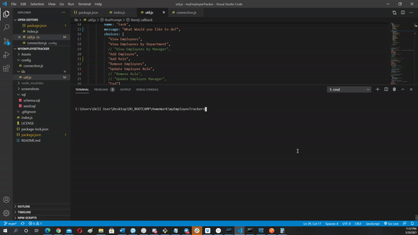

# MySQL: Employee Tracker

## Subject:
Developers are often tasked with creating interfaces that make it easy for non-developers to view and interact with information stored in databases. Often these interfaces are known as **C**ontent **M**anagement **S**ystems. In this assignment, my challenge is to architect and build a solution for managing a company's employees using node, inquirer, and MySQL.

## Description:
The database is designed following containing three tables:


* **department**:

  * **id** - INT PRIMARY KEY
  * **name** - VARCHAR(30) to hold department name

* **role**:

  * **id** - INT PRIMARY KEY
  * **title** -  VARCHAR(30) to hold role title
  * **salary** -  DECIMAL to hold role salary
  * **department_id** -  INT to hold reference to department role belongs to

* **employee**:

  * **id** - INT PRIMARY KEY
  * **first_name** - VARCHAR(30) to hold employee first name
  * **last_name** - VARCHAR(30) to hold employee last name
  * **role_id** - INT to hold reference to role employee has
  * **manager_id** - INT to hold reference to another employee that manages the employee being Created. This field may be null if the employee has no manager

### See Website
[Click Here](https://drive.google.com/file/d/1uHA9kPIwczc48fkClX3qaLsCmIXgpmAA/view) to see application video.


### Installation


<!-- GETTING STARTED -->

This is some useful steps, you must meet to run this page correctly 

### Prerequisites
You can use any code editor of your choise, i use Vs Code because it is open source and it understand git and do syntax highlighting very nicely.

* Go to
  [Click Here](https://code.visualstudio.com/download) to download Vs Code to your computer.
  
1. Clone the repo
   ```sh
   git clone  https://github.com/lemanou7/nodeJSHtmlGenerator.git
   ```
2. Get a linux shell emulator like Git bash or Powershell then:
    ```sh
    cd to where your repository folder is located in your computer


3. Run the inde.js file by entering this command if using Vs Code
   ```sh
   node index.js
   ```
   Then go to dis folder to see the generated Html, open it in any browser to see the result.


### See Application here

1. Look the App demonstration 



[Click Here To See The Video](https://drive.google.com/file/d/1pa04ML5H0diZH1u6Ma6BcD5ze2V4s8el/view)

<!-- CONTACT -->
## Contact

Drissa Bagate (<span style="color:#5ddcf0">**Django, Javascript Full Stack Developer**</span>) [GitHub](https://github.com/lemanou7) - lemanou7@yahoo.fr

Other Project link: [My Blog Post Python-Django Implemation](http://grandbuzz.herokuapp.com/)

